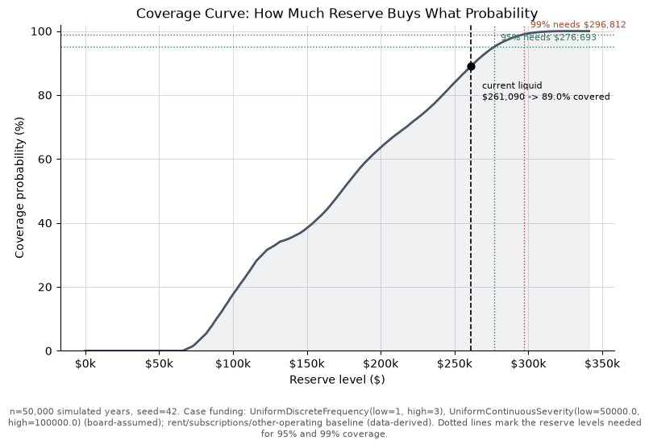
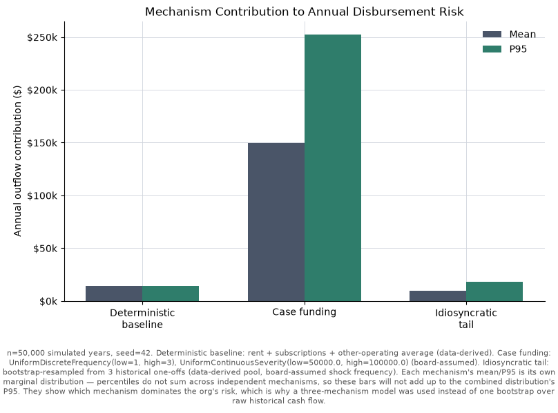
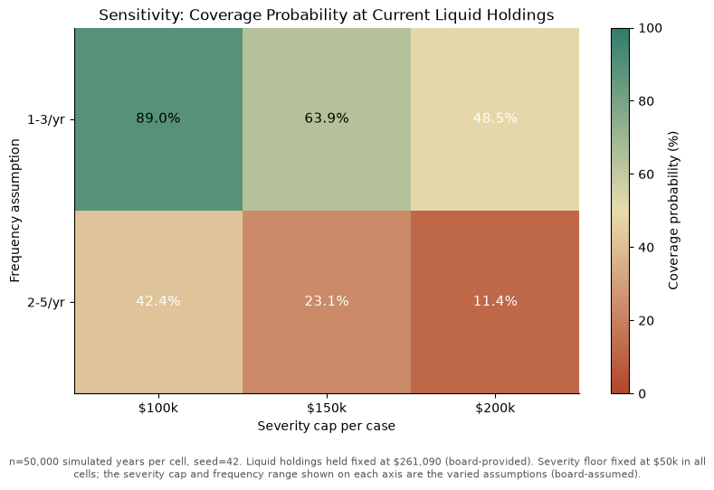

# Fortune — Cash Flow & Disbursement Risk Simulation Engine

> **A note on the data before anything else:** the two CSVs this engine was originally built and validated against are the real banking records of a real non-profit legal-aid fund. Those records — real account numbers, real vendor names, a real bounced cheque, a real six-figure case disbursement — are **not committed to this repository** and never will be. Everything in `data/` here is a synthetic, fabricated dataset (`scripts/generate_sample_data.py`) built to be structurally identical to the real one — same schema, same classification edge cases (irregular rent cadence, an NSF reversal, both kinds of internal transfer, a pre-funded disbursement, thin-sample one-offs, zero-activity months) — but with no real dates, amounts, account numbers, or names anywhere in it. The engine, tests, CLI, and figures below all run end-to-end on this synthetic file. Headline findings quoted below were computed against the real (non-committed) dataset and are labeled as such; the embedded figures are generated from the synthetic sample and are illustrative only.


**On the real (non-committed) dataset, at the model's board-adopted default assumptions (1–3 legal cases/year at $50K–$100K each), the organization's current ~$305K in liquid reserves cover about 97.7% of simulated years — but fall roughly $10,006 short of what's needed to cover the worst 1% of years (p99 ≈ $315,143).** The reserve is adequate for a typical year and even most bad years; it is not yet adequate for a genuinely bad year. (The figure above is generated from the synthetic sample dataset, not this real finding — see [Real findings vs. this repo's figures](#real-findings-vs-this-repos-figures).)

This is a decision-support tool for a fiduciary body that retains full responsibility for its own reserve decisions. It is not investment advice and it does not forecast markets.

---

## The problem

A small non-profit fund exists to pay for legal cases on behalf of the people it serves. Its Investment Policy Statement (IPS) requires an Operating Reserve equal to 12 months of projected disbursements, held 100% in cash-equivalents — no market risk. The practical question this tool answers: **how much cash does the org actually need to hold, and does it currently hold enough?**

## What this currently has

- A three-mechanism Monte Carlo engine — deterministic operating baseline, a case-funding frequency-severity model, and a bootstrap-resampled idiosyncratic tail — simulated independently and summed per year, instead of one naive bootstrap over raw historical cash flow (see [Why not just bootstrap](#why-not-just-bootstrap-the-historical-cash-flow) for why that's the wrong tool here).
- A rule-based transaction classifier (six buckets: recurring, case funding, internal transfer, returned/NSF item, idiosyncratic one-off, other) that excludes self-transfers and bounced payments from every outflow calculation, with regression tests for two real bugs found while building it (see [Corrections along the way](#corrections-along-the-way)).
- Bootstrap confidence intervals on thin-sample (n=3) tail percentiles, not just a point estimate — the report says out loud how much a percentile derived from three observations should be trusted.
- The IPS-mandated 12-month minimum kept visually and numerically separate from the model's statistical buffer, plus a coverage check against real liquid holdings at multiple confidence levels (p50/p75/p90/p95/p99).
- A CLI (`python -m fortune.cli`) with seeded, bit-for-bit reproducible runs, and a local JSON overrides mechanism (`--overrides-json`) so a real organization's real account numbers, amounts, and holdings never have to touch tracked source.
- Four matplotlib figures (headline distribution, coverage curve, mechanism decomposition, sensitivity grid), regenerable on demand via `--figures`.
- A full test suite: statistical correctness against known analytic ground truth, classification correctness, exact reproducibility, degenerate-input handling, monotonicity invariants, and stress scenarios.
- A seeded, reproducible synthetic sample dataset generator (`scripts/generate_sample_data.py`) standing in for the real, withheld data, exercising every classification edge case the real data has.

## What's next

- **Net cash-flow modeling (inflows − outflows), not outflows only.** This is the most significant planned extension — see [Honest limitations](#honest-limitations) for why outflow-only is conservative but incomplete.
- **Re-estimating case-funding frequency and severity empirically** once more real case-funding events accrue. Currently n=1, so Mechanism 2 is entirely board-assumed; it should become data-derived as history builds.
- **Portfolio/reserve allocation** — e.g. how much of the reserve should sit in pure cash vs. short-duration cash-equivalents — is explicitly out of scope for this phase. No Black-Litterman, no Ledoit-Wolf, no `cvxpy`.
- **A web UI or board-facing dashboard** in place of (or alongside) the CLI report.
- **An LLM/agent layer** for drafting the board memo or narrating the report in plain language from the structured result object.
- **Automated document generation** (e.g. a `.docx` board packet) built from the report and figures.
- **External market-data or benchmark-rate integration**, if and when a cash-vs-short-duration tradeoff becomes relevant to the board's decision.

## Stack

This is a local CLI tool, not a hosted service — there's no backend, database, or deployment to speak of, so this section is short by design:

- **Python 3.11+**
- [**numpy**](https://numpy.org/) — seeded Monte Carlo sampling (`default_rng`), percentile machinery
- [**pandas**](https://pandas.pydata.org/) — transaction loading and classification
- [**scipy**](https://scipy.org/) — analytic ground-truth distributions used in the statistical-correctness tests
- [**matplotlib**](https://matplotlib.org/) — the four figures
- [**pytest**](https://pytest.org/) — the test suite

Nothing beyond these five libraries, by design (see [Non-goals](#whats-next) above) — no web framework, no database, no external API client.

## Dataset

Two accounts, same schema: `Date`, `Description`, `Sub-description`, `Type of Transaction`, `Amount` (signed; negative = outflow), and a running `Balance`. In the real organization's case these are Scotiabank business-banking exports (chequing + savings); the loader (`loader.py`) is bank-agnostic beyond that schema.

**Real data is never committed** (see the note at the top of this README). What's in `data/` here is entirely synthetic:

- `scripts/generate_sample_data.py` — seeded (`--seed`, default reproducible), hand-places every classification-relevant pattern the real data has (irregular-cadence rent, an NSF reversal, both kinds of internal transfer, a pre-funded large disbursement, three idiosyncratic one-offs of differing size, two zero-activity months), then layers in seeded noise transactions (small service charges, POS purchases, interest credits) for realistic density.
- Regenerate it any time with `python scripts/generate_sample_data.py` — same seed, byte-identical output.
- To point this engine at your own real data instead, see [Running this against real data](#running-this-against-real-data) — real filenames and real assumption values are supplied locally and are never written into a tracked file.

TODO: the generator only produces outflow-relevant patterns; once net cash-flow modeling ([What's next](#whats-next)) lands, it should also generate a richer set of inflow patterns (e.g. multiple revenue streams, seasonal levy timing) to exercise that mechanism.

## Why not just bootstrap the historical cash flow?

The obvious first approach — resample raw monthly net cash flow from the bank exports and take a percentile — is the wrong tool here, and this repo deliberately does not implement it. In the real data, two or three large transactions dominate the historical variance: one large case disbursement and a couple of one-off operating costs. A naive bootstrap's output swings enormously depending on which months happen to land in a given resample, while confidently reporting a single number. Worse, some of the largest apparent "outflows" in the raw ledger are not expenses at all — they're internal transfers between the org's own chequing and savings accounts, moved specifically to pre-fund the case payout shortly before it went out. A naive bootstrap over raw transactions would launder these back-and-forth transfers into the same distribution as real spending, and could even net a pre-funding inflow against its own disbursement.

Instead, this engine models three **independent** mechanisms and sums them per simulated year:

1. **Deterministic baseline** (`baseline.py`) — rent, subscriptions, and average small operating costs. Fixed and known; never sampled.
2. **Case-funding frequency–severity model** (`case_funding.py`) — the org's core mission spending, modeled as a compound distribution (draw a case count, then that many independent severities, then sum) using forward-looking board planning assumptions, because only one historical case-funding event exists — nowhere near enough to fit a rate.
3. **Idiosyncratic tail bucket** (`tail.py`) — bootstrap-resampled from the three confirmed historical one-off costs, with an explicit bootstrap confidence interval because three observations is a fragile basis for any percentile.

Internal transfers and one returned/NSF item are identified and excluded entirely, so no self-transfer or bounced payment is ever counted as spend. Two real classification bugs turned up while building this, both now covered by regression tests (see [Corrections along the way](#corrections-along-the-way)).

## Assumptions and their provenance

Every assumption lives in [`config.py`](src/fortune/config.py) with a docstring stating its provenance, and is also part of every report's output as a manifest. The table below shows the **synthetic sample's** default values (what you get out of the box from this repo); the real organization's real values are supplied locally via an overrides file and never committed (see [Running this against real data](#running-this-against-real-data)).

| Assumption | Sample default | Provenance |
|---|---|---|
| Rent | $1,200/month | data-derived |
| Subscriptions | $40/month | data-derived |
| Zero-activity months | detected at runtime from the ledger | data-derived |
| Case-funding frequency | 1–3 cases/year, uniform | **board-assumed** |
| Case-funding severity | $50,000–$100,000/case, uniform | **board-assumed** |
| Idiosyncratic shock frequency | 1/year (simplifying default) | board-assumed |
| Idiosyncratic shock severity | bootstrap-resampled from 3 confirmed one-offs | data-derived |
| IPS minimum reserve | 12 months of projected operating disbursements | **policy** (ratified IPS) |
| Liquid holdings | fabricated figures in the sample; real figures supplied locally | board-provided |

The case-funding severity range is deliberately narrow as a solvency constraint: an earlier, more aggressive assumption set (2–5 cases/yr, $50K–$200K severity) produced, on the real data, a 99th-percentile annual disbursement of roughly **$835,885** against **~$305K** in true liquid holdings — a 17.2% coverage probability, i.e. not fundable under any reasonable read of the numbers. Figure 4 (generated from the synthetic sample below) shows exactly what coverage each combination of frequency and severity assumption buys, so the board can see what its own parameter choices cost.

## Real findings vs. this repo's figures

Because the real dataset can't be committed, there's a hard split in this README between two kinds of numbers:

- **Findings** (the coverage percentages and dollar figures quoted in prose) are computed against the real, non-committed dataset and are the actual answer to the board's question. They are labeled "real data" wherever they appear.
- **Figures** (the PNGs embedded below) are regenerated from the synthetic sample dataset committed to this repo, because committing a figure derived from real transaction data would defeat the point of withholding it. They are labeled "synthetic sample — illustrative only." The synthetic sample's own numbers (e.g. its own coverage probability, ~89.0%) are real outputs of this code, just not indicative of any real organization's actual position — they're fabricated inputs producing a fabricated answer, shaped to exercise the same code paths.

If you have access to the real dataset (or your own organization's real data), run it locally with `--overrides-json` (see below) to get figures and a report that match your own real findings.

### Figure 2 — Coverage curve (synthetic sample)


This is the board's actual question in one picture: how much reserve buys what probability of being covered. (On the real data, the equivalent curve puts the current liquid position at 97.7% coverage, needing ~$315,143 for 99%; the shape is the same, the synthetic numbers on this specific image are not the real ones.)

### Figure 3 — Mechanism contribution (synthetic sample)


Case funding dominates both the mean and the tail of the org's disbursement risk in both the real and synthetic data — this is the empirical justification for building three separate mechanisms instead of one bootstrap over raw historical cash flow.

### Figure 4 — Sensitivity grid (synthetic sample)


This makes the board's cap decision legible: loosen either the frequency or severity assumption and coverage collapses fast. On the real data, 2–5 cases/yr at a $200K cap covers only 17.2% of simulated years — the "not fundable" scenario referenced above.

## Honest limitations

This model is only as good as its inputs, and several of those inputs are thin. These apply to the real, non-committed dataset the engine was built against:

- **n=1 case-funding history.** Only one confirmed case-funding disbursement exists in the real record. Frequency and severity for Mechanism 2 are forward-looking board planning assumptions, not empirical estimates — there is no way to statistically validate 1–3 cases/year or $50K–$100K severity against history. If the org funds a second or third case, revisit these assumptions immediately.
- **n=3 idiosyncratic tail bucket.** The tail bucket is bootstrap-resampled from three historical one-off costs. Every result derived from it carries a wide bootstrap confidence interval, reported alongside the point estimate, precisely because three observations cannot reliably characterize a tail.
- **~24-month observation window.** Both real accounts span roughly two years of history. Two calendar months in that window show zero confirmed operating activity in the chequing account; these are modeled as a deterministic reduction to the baseline rather than random low draws, but a two-year window is too short to know whether this pattern recurs annually or was specific to those months.
- **One returned/NSF item.** A rent cheque bounced and was reversed the same day, then reissued via a later cheque. It's excluded from all outflow mechanisms (no cash actually left the org), but it's a real liquidity-stress signal worth the board's attention independent of anything this model computes, and it is surfaced explicitly as a warning in every report.
- **Outflows only — this is the most significant planned extension.** The engine models disbursements and checks them against a static liquid balance, which implicitly assumes zero income. The real data shows meaningful revenue inflows (membership/levy-style receipts and transfers in), and the org's governing policy explicitly assumes fee collection covers part of the operating reserve. Outflow-only is the conservative direction — it will not produce a dangerously optimistic answer — but it is not the full picture. Modeling net flow (inflows less outflows) is the natural v2 (see [What's next](#whats-next)).
- **This tool does not predict markets, cannot see legal cases before they're filed, and does not replace the board's judgment.** It converts stated assumptions into a distribution; if the assumptions are wrong, so is the distribution.

## Corrections along the way

Two real classification bugs turned up while building this engine against the real data, both now covered by regression tests against the synthetic sample:

1. **A one-off cost's identifying text lived in `Sub-description`, not `Description`.** The exact-match confirmation rule originally only checked `Description`, silently missing one of three confirmed idiosyncratic events (undercounting n=3 as n=2). Fixed by checking both columns; regression-tested via the synthetic sample's own "Draft Purchase" one-off, deliberately placed in `Sub-description`.
2. **An internal transfer without an account-number reference was miscounted as real operating spend.** Some internal transfers reference the counterpart account number in the sub-description; others (e.g. a mobile-transfer label) don't, but still show the same-day, equal-and-opposite, cross-account pattern of a self-transfer. The original rule only caught the first kind, inflating the deterministic baseline by counting a real internal transfer as an operating outflow. Fixed by generalizing the rule to catch same-day equal-and-opposite cross-account pairs structurally, regardless of whether the sub-description names the counterpart account.

Both fixes changed the real-data result materially: the corrected classification lowered the deterministic baseline and moved the headline finding from a rougher early estimate to the 97.7% coverage / $315,143 p99 figures quoted above. This is a good illustration of why the classification layer is a separate, independently-tested module rather than inlined into the simulation: a bug there silently mislabels real transfers as real spending (or vice versa), and the effect shows up as a wrong reserve recommendation with no obvious symptom.

## Installation and usage

Requires Python 3.11+.

```bash
python3 -m venv .venv
source .venv/bin/activate
pip install -r requirements.txt
```

Run the report against the committed synthetic sample:

```bash
python -m fortune.cli --data data/ --seed 42
```

Run the report and regenerate all four figures into `outputs/` (gitignored — regenerate locally, don't commit):

```bash
python -m fortune.cli --data data/ --seed 42 --figures
```

### Running this against real data

Real data and real assumption values must never be committed to this repo. To run this against your own organization's real export:

1. Put your real CSVs anywhere outside version control (or in `data/` — the real filenames are gitignored by default).
2. Copy `local_config.example.json` to a local file (e.g. `local_config.json`, already gitignored) and fill in your real rent, subscription vendor, account numbers, confirmed events, and liquid holdings.
3. Run:

```bash
python -m fortune.cli \
  --data data/ \
  --chequing-file "your_real_chequing_export.csv" \
  --savings-file "your_real_savings_export.csv" \
  --overrides-json local_config.json \
  --seed 42 --figures
```

Nothing about your real organization ever needs to be typed into a tracked file.

### Other useful overrides

See `python -m fortune.cli --help` for the full list.

```bash
python -m fortune.cli --data data/ --seed 42 --iterations 100000
python -m fortune.cli --data data/ --seed 42 --severity-min 50000 --severity-max 200000 --frequency-min 2 --frequency-max 5
```

Run the tests:

```bash
pytest
```

Regenerate the synthetic sample dataset (deterministic given the same seed):

```bash
python scripts/generate_sample_data.py
```

## Package layout

```
src/fortune/
  loader.py        CSV ingestion, date parsing, schema validation
  classify.py       Transaction classification rules (pure functions, no I/O)
  baseline.py        Mechanism 1: deterministic operating baseline
  case_funding.py     Mechanism 2: case-funding frequency-severity model
  tail.py              Mechanism 3: idiosyncratic tail bucket + bootstrap CI
  simulate.py           Combination, orchestration, result objects
  report.py              Human-readable stdout report
  figures.py               The four PNGs above
  config.py                 Every assumption, typed, with provenance + local-override loading
  cli.py                     python -m fortune.cli entry point
scripts/
  generate_sample_data.py    Generates the committed synthetic sample dataset
```

Every simulation run is seeded via `numpy.random.default_rng(seed)` and is exactly reproducible: same config, same data, same seed reproduces identical results, including array contents, bit for bit.
