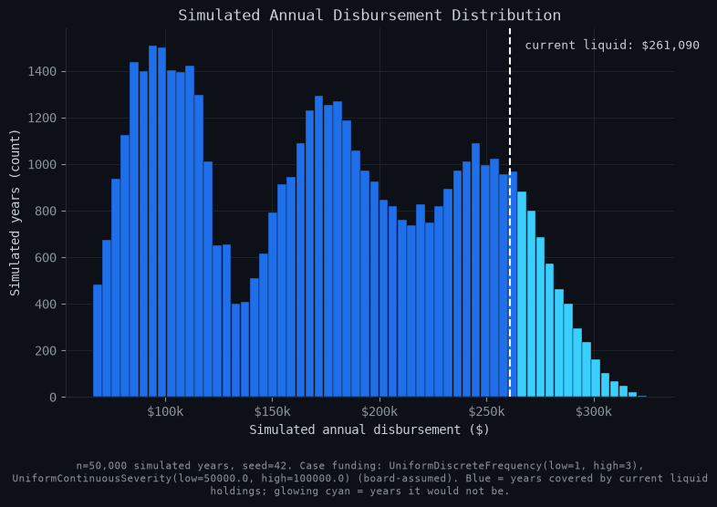

# Fortune

Full pipeline for how a legal-aid non-profit should hold its cash: size the reserve, allocate it across cash / fixed income / equity under the org's investment policy, check current holdings against that policy, and produce a board-facing report.

Built and validated on organisation's real banking data. That data isn't in this repo — `data/` is synthetic, generated to match its structure. See `scripts/generate_sample_data.py`.

This model currently has the following features:

- Three-mechanism Monte Carlo engine (deterministic baseline + case-funding frequency/severity model + bootstrap idiosyncratic tail), instead of one naive bootstrap over raw cash flow
- Rule-based transaction classifier which excludes internal transfers and bounced payments from spend
- Bootstrap confidence intervals on thin-sample tail estimates, not just a point number
- CLI with seeded, reproducible runs, and a local-overrides file so real org data never touches tracked code
- Four matplotlib figures, regenerable on demand
- Full test suite: statistical correctness, classification, reproducibility, degenerate inputs, monotonicity, stress cases

Future features I would like to include:

- Net cash flow modelling: track inflows (levy receipts, transfers in) against outflows instead of assuming zero income
- Re-estimate case-funding frequency/severity empirically once more real events accrue; it's board-assumed off n=1 right now
- Portfolio / reserve allocation: split the non-operating reserve across cash, fixed income, and equity under the org's policy constraints (Black-Litterman expected returns, Ledoit-Wolf covariance shrinkage), and flag holdings that fall outside policy ranges
- Web UI instead of CLI, so the board doesn't need a terminal to see this
- LLM layer that drafts the board memo from the report output
- Auto-generate the full board packet (report + figures + memo) as one document

## Stack

- Claude Sonnet 5
- Python 3.11+
- numpy - Monte Carlo sampling
- pandas - transaction loading/classification
- scipy - ground-truth stats for tests
- matplotlib - figures
- pytest - tests

No web framework, no database, no external API. Just a CLI.

## Dataset

Two bank accounts (chequing + savings), same schema: date, description, sub-description, type, amount, balance.

Real data withheld. `scripts/generate_sample_data.py` builds a synthetic sample with the same edge cases: irregular rent cadence, an NSF reversal, both kinds of internal transfer, a pre-funded disbursement, thin-sample one-offs, zero-activity months.

TODO: generator doesn't model inflows yet.

## How it works

1. `loader.py` - load + validate the CSVs
2. `classify.py` - bucket every transaction (recurring / case funding / internal transfer / returned item / one-off / other)
3. `baseline.py`, `case_funding.py`, `tail.py` - the three mechanisms
4. `simulate.py` - combine mechanisms, run the Monte Carlo
5. `report.py` / `figures.py` - output

## Results



On the real data: current reserves cover ~97.7% of simulated years, short ~$10K at the 99th percentile (~$315K needed). Figure above is from the synthetic sample, not the real numbers.

## Run it

```bash
pip install -r requirements.txt
python -m fortune.cli --data data/ --seed 42 --figures
pytest
```

Against real data: fill in `local_config.example.json`, pass it via `--overrides-json`.
